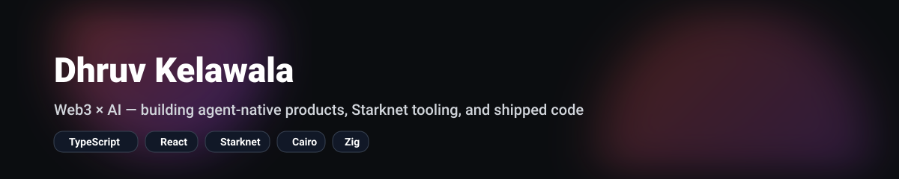

<!--
Profile README for: https://github.com/dhruvkelawala/dhruvkelawala
Copy this file to that repo as README.md.
-->

  

  <a href="https://x.com/dhruv_kelawala">X</a> •
  <a href="https://www.linkedin.com/in/dhruvrk2000/">LinkedIn</a> •
  <a href="http://dhruvkelawala.com">Website</a>

  
  &nbsp;
  
  &nbsp;
  
  &nbsp;
  
  &nbsp;
  

---

## 🚧 Now

- Shipping agent-native products that feel invisible
- Building Starknet dev tooling and wallet UX
- Making small, composable libraries that other builders actually use

---

## 🛠️ Featured Projects

  
  

  
  

Quick context:
- **web3-starknet-react** — React hooks + wallet connectors for Starknet dApps
- **cairo-base64** — Base64 encoding for Cairo contracts
- **gousto-agent-skill** — agent skill to search 9k+ recipes with structured output
- **argent-ledger-poc** — Ledger signing POC for Starknet

---

## 🌟 Open Source Cred

- Core contributor to **Argent X** (Starknet wallet): https://github.com/argentlabs/argent-x
- Built wallet / dapp connectors used by real teams

---

## 📫 Reach out

If you’re building something interesting in Starknet / agent tooling, I’m usually down to chat.

- https://x.com/dhruv_kelawala
- https://www.linkedin.com/in/dhruvrk2000/
